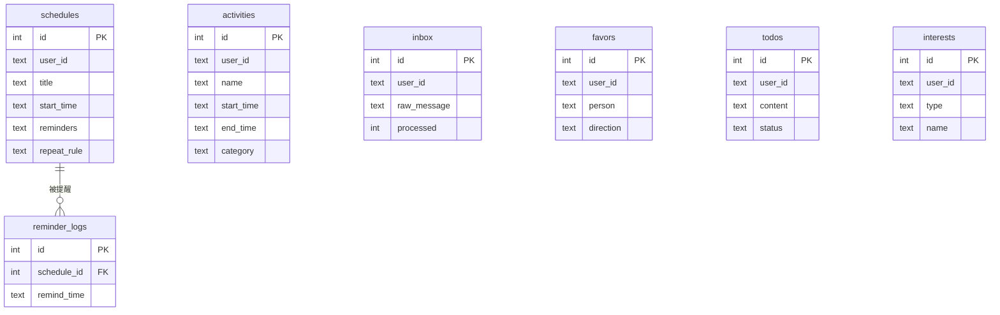

# 数据库设计

本文档详述 Dailylaid 的 SQLite 数据库设计，包括每张表的结构、字段说明、查询模式和扩展方向。

---

## 📐 设计概述

- **数据库引擎**：SQLite 3（文件级嵌入式数据库）
- **存储路径**：`data/dailylaid.db`（可通过 `.env` 配置 `DATABASE_PATH` 修改）
- **管理器**：`services/database.py` 的 `DatabaseManager` 类
- **连接方式**：每次操作创建新连接（`with self._get_connection() as conn`），自动管理事务

### 连接设置

```python
conn = sqlite3.connect(self.db_path)
conn.row_factory = sqlite3.Row    # 查询结果可按列名访问
```

---

## 📊 表结构全览

共 7 张表，按使用状态分类：



---

## 表 1: schedules（日程表）🟢 使用中

用来存储用户的未来日程安排。

```sql
CREATE TABLE schedules (
    id INTEGER PRIMARY KEY AUTOINCREMENT,
    user_id TEXT NOT NULL,                      -- QQ 号
    title TEXT NOT NULL,                        -- 日程标题
    description TEXT,                           -- 详细描述
    start_time TEXT NOT NULL,                   -- 开始时间 (ISO 8601 格式)
    end_time TEXT,                              -- 结束时间
    location TEXT,                              -- 地点
    reminders TEXT DEFAULT '[]',                -- 提醒时间列表 (JSON 数组, 单位分钟)
    repeat_rule TEXT DEFAULT '{"type": "none"}', -- 重复规则 (JSON)
    source_message TEXT,                        -- 创建该日程的原始消息
    related_messages TEXT DEFAULT '[]',         -- 相关消息列表 (JSON 数组)
    created_at TIMESTAMP DEFAULT CURRENT_TIMESTAMP,
    updated_at TIMESTAMP DEFAULT CURRENT_TIMESTAMP
);
```

### 关键字段详解

**reminders** (JSON 数组)：
```json
[60, 30, 10]    // 提前 60分钟, 30分钟, 10分钟 各发一次提醒
[]              // 不提醒
```

**repeat_rule** (JSON 对象)：
```json
{"type": "none"}                                    // 不重复
{"type": "daily", "interval": 1}                    // 每天
{"type": "weekly", "weekdays": [0, 2, 4]}           // 每周一三五
{"type": "monthly", "monthday": 15}                 // 每月15日
{"type": "weekly", "until": "2026-06-01"}           // 重复到指定日期
```

### 关联查询方法

| 方法 | 用途 | 调用方 |
|------|------|--------|
| `insert_schedule(data)` | 插入日程 | ScheduleTool |
| `get_schedules(user_id, start, end)` | 日期范围查询 | ScheduleListTool |
| `get_schedule_by_id(id)` | 单条查询 | MCP schedule_update |
| `update_schedule(id, updates)` | 部分更新 | MCP schedule_update |
| `delete_schedule(id)` | 删除 | MCP schedule_delete |
| `get_upcoming_schedules(hours)` | 未来 N 小时（提醒用） | ReminderService |

---

## 表 2: activities（活动记录表）🟢 使用中

存储用户已完成的活动，构成时间线。

```sql
CREATE TABLE activities (
    id INTEGER PRIMARY KEY AUTOINCREMENT,
    user_id TEXT NOT NULL,
    name TEXT NOT NULL,                         -- 活动名称
    description TEXT,                           -- 详细描述
    start_time TEXT NOT NULL,                   -- 开始时间 (ISO 8601)
    end_time TEXT,                              -- 结束时间 (可为 NULL = 正在进行中)
    category TEXT,                              -- 分类: 工作/学习/娱乐/生活/其他
    tags TEXT,                                  -- 标签 (JSON 数组)
    location TEXT,                              -- 地点
    related_messages TEXT NOT NULL DEFAULT '[]', -- 触发该记录的原始消息列表
    created_at TIMESTAMP DEFAULT CURRENT_TIMESTAMP,
    updated_at TIMESTAMP DEFAULT CURRENT_TIMESTAMP
);
```

### 设计特点

- **`end_time = NULL`** 表示活动正在进行中，后续可通过 `TimelineUpdateTool` 补充
- **`related_messages`** 记录触发该条记录的原始用户消息，用于追溯

### 关联查询方法

| 方法 | 用途 | 调用方 |
|------|------|--------|
| `insert_activity(data)` | 插入活动 | TimelineRecordTool |
| `update_activity(id, updates)` | 更新（补充 end_time） | TimelineUpdateTool |
| `get_activities(user_id, start, end)` | 日期范围查询 | TimelineListTool, TimelineViewTool |
| `get_activities_recent(user_id, hours)` | 最近 N 小时 | Agent 上下文注入, TimelineListTool |
| `get_activity_by_id(id)` | 单条查询 | TimelineUpdateTool |
| `check_activity_overlap(user_id, start, end)` | 时间重叠检测 | TimelineRecordTool |
| `find_unclosed_activities(user_id, pattern, hours)` | 查找未结束的活动 | 预留 |

---

## 表 3: inbox（收集箱）🟢 使用中

暂存无法分类的用户消息。

```sql
CREATE TABLE inbox (
    id INTEGER PRIMARY KEY AUTOINCREMENT,
    user_id TEXT NOT NULL,
    raw_message TEXT NOT NULL,      -- 原始消息内容
    processed INTEGER DEFAULT 0,    -- 是否已处理 (0=否, 1=是)
    created_at TIMESTAMP DEFAULT CURRENT_TIMESTAMP
);
```

### 关联方法

| 方法 | 用途 |
|------|------|
| `add_to_inbox(user_id, message)` | 保存消息 |
| `get_inbox(user_id, limit)` | 获取未处理消息 |

> [!NOTE]
> `archive_inbox_item()` 方法尚未实现（`InboxTool.archive_item` 中标注 TODO）。

---

## 表 4: reminder_logs（提醒日志）🟢 使用中

防止同一提醒被重复发送。

```sql
CREATE TABLE reminder_logs (
    id INTEGER PRIMARY KEY AUTOINCREMENT,
    schedule_id INTEGER NOT NULL,       -- 关联的日程 ID
    remind_time TEXT NOT NULL,          -- 提醒触发时间 (ISO 8601)
    sent_at TIMESTAMP DEFAULT CURRENT_TIMESTAMP,
    UNIQUE(schedule_id, remind_time)    -- 联合唯一约束：同一提醒只能记录一次
);
```

### 关联方法

| 方法 | 用途 |
|------|------|
| `log_reminder(schedule_id, remind_time)` | 记录已发送 |
| `is_reminder_sent(schedule_id, remind_time)` | 检查是否已发送 |

**工作原理**：`ReminderService` 每分钟检查一次，在发送提醒前先调用 `is_reminder_sent()` 检查，发送后调用 `log_reminder()` 记录。`UNIQUE` 约束确保即使并发也不会重复。

---

## 表 5: favors（人情记录）🟡 待接入

表已创建，对应的 DatabaseManager 方法已存在，但 Tool 尚未实现。

```sql
CREATE TABLE favors (
    id INTEGER PRIMARY KEY AUTOINCREMENT,
    user_id TEXT NOT NULL,
    person TEXT NOT NULL,            -- 对方名称
    event TEXT NOT NULL,             -- 事件描述
    direction TEXT NOT NULL,         -- 'given'(我给) / 'received'(我收)
    date TEXT,                       -- 日期
    status TEXT DEFAULT 'pending',   -- 'pending' / 'returned'(已还)
    created_at TIMESTAMP DEFAULT CURRENT_TIMESTAMP
);
```

### 已实现的方法

| 方法 | 说明 |
|------|------|
| `add_favor(user_id, person, event, direction, date)` | 添加记录 |
| `get_favors(user_id, person=None)` | 查询记录（支持按人名模糊搜索） |

---

## 表 6: todos（待办）🟡 待接入

```sql
CREATE TABLE todos (
    id INTEGER PRIMARY KEY AUTOINCREMENT,
    user_id TEXT NOT NULL,
    content TEXT NOT NULL,           -- 待办内容
    category TEXT,                   -- 分类
    due_date TEXT,                   -- 截止日期
    status TEXT DEFAULT 'pending',   -- 'pending' / 'done'
    created_at TIMESTAMP DEFAULT CURRENT_TIMESTAMP
);
```

### 已实现的方法

| 方法 | 说明 |
|------|------|
| `add_todo(user_id, content, category, due_date)` | 添加待办 |
| `get_todos(user_id, status)` | 按状态查询 |
| `complete_todo(todo_id)` | 标记完成 |

---

## 表 7: interests（兴趣记录）🟡 待接入

```sql
CREATE TABLE interests (
    id INTEGER PRIMARY KEY AUTOINCREMENT,
    user_id TEXT NOT NULL,
    type TEXT NOT NULL,              -- 'blogger' / 'topic' / 'thing'
    name TEXT NOT NULL,              -- 名称
    description TEXT,                -- 描述
    tags TEXT,                       -- 标签 (JSON 数组)
    source TEXT,                     -- 来源（哪个平台发现的）
    created_at TIMESTAMP DEFAULT CURRENT_TIMESTAMP
);
```

### 已实现的方法

| 方法 | 说明 |
|------|------|
| `add_interest(user_id, type_, name, ...)` | 添加兴趣 |
| `get_interests(user_id, type_=None)` | 查询（可按类型过滤） |

---

## 📌 设计原则

1. **所有时间字段使用 ISO 8601 字符串**：SQLite 没有原生 datetime 类型，使用 TEXT 存储 ISO 格式的时间字符串，便于排序和范围查询
2. **JSON 字段用于灵活数据**：`reminders`, `repeat_rule`, `tags`, `related_messages` 等字段使用 JSON 字符串存储，在 Python 层用 `json.loads()` / `json.dumps()` 处理
3. **每张表都有 `user_id`**：支持多用户（按 QQ 号隔离数据）
4. **`created_at` / `updated_at` 自动时间戳**：`CURRENT_TIMESTAMP` 由 SQLite 自动填充
5. **每次操作新建连接**：避免长连接问题，适合低并发场景

---

*最后更新: 2026-03-11*
