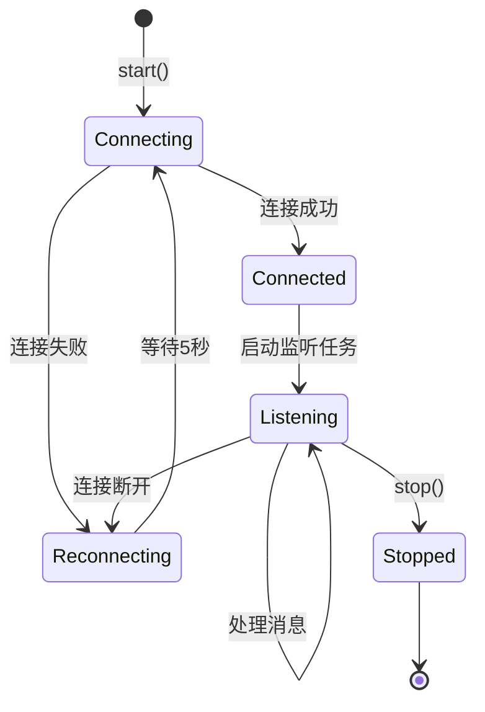
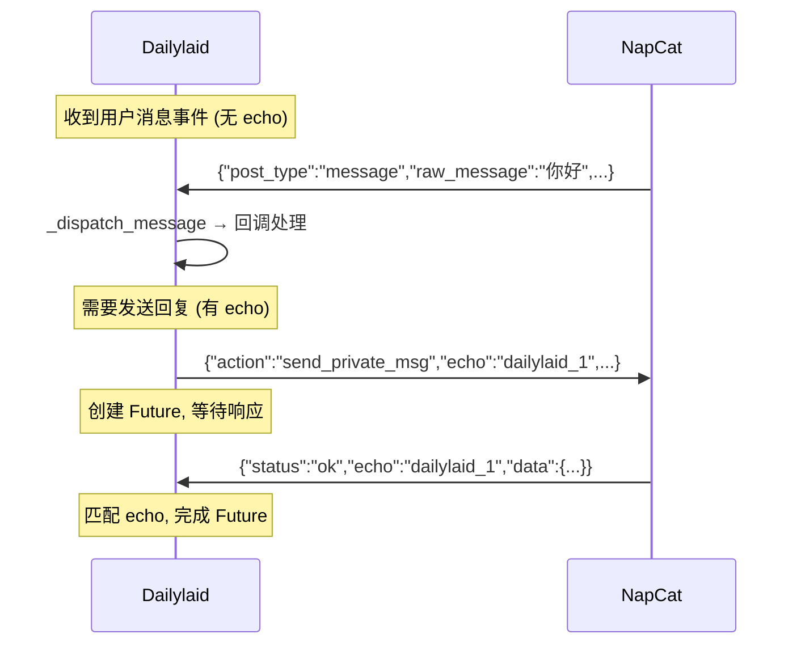

# 网络适配器与消息流设计

本文档详解 Dailylaid 的网络通信层，包括适配器抽象设计、WebSocket 实现、NapCat OneBot 协议集成，以及消息收发的完整流程。

---

## 📐 架构概述

Dailylaid 通过 NapCat（QQ 机器人框架）与 QQ 通信。NapCat 基于 **OneBot 11** 协议，支持多种网络连接方式。

```
┌────────────────┐         ┌─────────────┐         ┌──────────────┐
│   QQ 客户端     │ ◄─────▶ │   NapCat    │ ◄══WS══▶│   Dailylaid   │
│  (用户设备)     │   QQ协议  │  (远程服务器) │  OneBot  │  (本地/服务器)  │
└────────────────┘         └─────────────┘         └──────────────┘
```

---

## 适配器抽象层

### BaseAdapter (`services/adapters/base_adapter.py`)

所有网络适配器的基类，定义统一接口：

```python
class BaseAdapter(ABC):
    def __init__(self):
        self._message_callbacks = []   # 消息回调列表
        self._running = False          # 运行状态
    
    # === 子类必须实现 ===
    async def start(self):             # 启动连接
    async def stop(self):              # 停止连接
    async def send_message(self, target_type, target_id, message) -> dict:
    
    # === 已实现 ===
    def on_message(self, callback):    # 注册消息回调
    async def _dispatch_message(data): # 分发消息到所有回调
    bool is_running                    # 运行状态属性
```

### 消息回调机制

```python
# 注册回调（在 app.py 中）
adapter.on_message(on_message_handler)

# 当适配器收到消息时自动分发
async def _dispatch_message(self, data):
    for callback in self._message_callbacks:
        result = callback(data)
        if hasattr(result, '__await__'):     # 支持同步和异步回调
            await result
```

### 支持的适配器模式

| 模式 | 类 | 通信方向 | 实现状态 |
|------|-----|----------|----------|
| 正向 WebSocket | `WebSocketAdapter` | Dailylaid → NapCat | ✅ 已实现 |
| HTTP Client | - | NapCat → Dailylaid | ❌ 未实现 |
| 反向 WebSocket | - | NapCat → Dailylaid | ❌ 未实现 |

---

## WebSocket 适配器详解

### 正向 WebSocket (`services/adapters/ws_adapter.py`)

Dailylaid 作为 **WebSocket 客户端**，主动连接到 NapCat 的 WS 服务器。

#### 初始化参数

```python
adapter = WebSocketAdapter(
    ws_url="ws://server-ip:3001",   # NapCat WS 地址
    token="secret_token"             # 认证 Token（可选）
)
```

#### 连接流程



**自动重连**：连接失败或断开后，自动等待 5 秒重试（`_reconnect_interval = 5`）。

#### 认证方式

```python
headers = {}
if self.token:
    headers["Authorization"] = f"Bearer {self.token}"

self.ws = await websockets.connect(
    self.ws_url,
    additional_headers=headers
)
```

Token 通过 HTTP Header 的 `Authorization: Bearer <token>` 方式传递。

---

## OneBot 11 消息协议

### 事件上报格式

NapCat 通过 WebSocket 推送事件，所有事件都包含 `post_type` 字段：

```json
{
    "post_type": "message",
    "message_type": "private",
    "user_id": 1659388154,
    "raw_message": "明天下午3点开会",
    "group_id": null,
    "time": 1709912345
}
```

| 字段 | 说明 |
|------|------|
| `post_type` | 事件类型：`message`(消息), `notice`(通知), `meta_event`(元事件) |
| `message_type` | 消息类型：`private`(私聊), `group`(群聊) |
| `user_id` | 发送者 QQ 号 |
| `group_id` | 群号（私聊时为 null） |
| `raw_message` | 纯文本消息内容 |

### API 调用格式

Dailylaid 通过 WebSocket 发送 API 请求（如发消息）：

```json
{
    "action": "send_private_msg",
    "params": {
        "user_id": 1659388154,
        "message": "✅ 已添加日程\n📅 开会\n⏰ 03月12日 15:00"
    },
    "echo": "dailylaid_42"
}
```

| 字段 | 说明 |
|------|------|
| `action` | API 名称（如 `send_private_msg`, `send_group_msg`） |
| `params` | API 参数 |
| `echo` | 请求标识符，用于匹配响应 |

### Echo 请求/响应匹配

WebSocket 是全双工的，请求和响应不是一一对应的。Dailylaid 使用 `echo` 字段匹配：

```python
class WebSocketAdapter:
    _echo_counter = 0           # 递增计数器
    _pending_requests = {}      # {echo_id: asyncio.Future}
    
    async def _call_api(self, action, params, timeout=30):
        # 1. 生成唯一 echo
        self._echo_counter += 1
        echo = f"dailylaid_{self._echo_counter}"
        
        # 2. 创建 Future 并注册
        future = asyncio.get_event_loop().create_future()
        self._pending_requests[echo] = future
        
        # 3. 发送请求
        await self.ws.send(json.dumps({
            "action": action, "params": params, "echo": echo
        }))
        
        # 4. 等待响应（带超时）
        return await asyncio.wait_for(future, timeout=timeout)
    
    async def _handle_message(self, data):
        echo = data.get("echo")
        if echo and echo in self._pending_requests:
            # 匹配到请求 → 设置 Future 结果
            self._pending_requests.pop(echo).set_result(data)
            return
        
        # 不是响应 → 是事件上报 → 分发给回调
        if data.get("post_type"):
            await self._dispatch_message(data)
```

**时序图**：



---

## 消息处理完整流程

从 NapCat 收到消息到发出回复的完整流程：

```python
# 1. WebSocketAdapter._listen() 收到原始消息
async for message in self.ws:
    data = json.loads(message)
    await self._handle_message(data)

# 2. _handle_message() 判断是事件还是 API 响应
#    → 事件 → _dispatch_message() → 回调

# 3. app.py 中的 on_message 回调
async def on_message(data):
    # 3a. 只处理 message 类型
    if data.get("post_type") != "message":
        return
    
    # 3b. 消息过滤（白名单检查）
    if not Config.is_allowed(user_id, group_id):
        return
    
    # 3c. 快捷命令检查
    if raw_message.startswith("/"):
        reply = await handle_command(user_id, raw_message, db)
    
    # 3d. 非命令 → Agent 处理
    if reply is None:
        reply = await agent.process(user_id, raw_message)
    
    # 3e. 发送回复
    if message_type == "group":
        await adapter.send_message("group", group_id, reply)
    else:
        await adapter.send_message("private", int(user_id), reply)
```

### 消息过滤策略 (`config.py`)

```python
@classmethod
def is_allowed(cls, user_id, group_id=None):
    # 无白名单配置 → 允许所有
    if not cls.ALLOWED_USERS and not cls.ALLOWED_GROUPS:
        return True
    
    # 群消息 → 检查群号
    if group_id:
        return str(group_id) in cls.ALLOWED_GROUPS
    
    # 私聊 → 检查用户 QQ 号
    return str(user_id) in cls.ALLOWED_USERS
```

---

## 提醒消息发送

`ReminderService` 通过注入的回调函数发送提醒消息：

```python
# app.py 中注入回调
async def send_reminder_message(user_id, message):
    if _adapter:
        await _adapter.send_message("private", int(user_id), message)

reminder_service = ReminderService(db, send_callback=send_reminder_message)
```

提醒消息始终发送到私聊（`"private"`），因为日程提醒是个人事务。

---

## 扩展：新增适配器

如果要实现其他连接模式（如 HTTP Client 或反向 WebSocket），需要：

1. 在 `services/adapters/` 下创建新文件（如 `http_adapter.py`）
2. 继承 `BaseAdapter`，实现 `start()`, `stop()`, `send_message()` 三个方法
3. 在 `app.py` 中根据 `Config.NAPCAT_MODE` 判断使用哪个适配器

```python
# app.py 中的适配器选择逻辑
if Config.NAPCAT_MODE == "ws_server":
    adapter = WebSocketAdapter(ws_url=..., token=...)
elif Config.NAPCAT_MODE == "http_client":
    adapter = HttpAdapter(callback_url=..., napcat_url=...)
elif Config.NAPCAT_MODE == "ws_client":
    adapter = ReverseWebSocketAdapter(host=..., port=...)
```

---

*最后更新: 2026-03-11*
