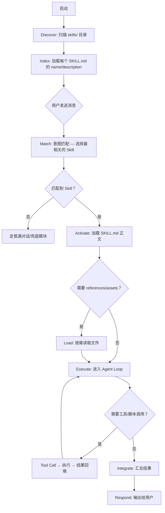

# Skills 概念总览

> 📚 本文档面向人类开发者和后续 AI Agent，系统介绍 "Skills" 的概念、定位与核心价值。

---

## 1. 什么是 Skills？

**一句话定义**：Skill 是一个**可发现、可复用、渐进式加载**的"过程性能力包"，以文件夹为最小分发单元。

它不是一段提示词，也不是一个工具定义，而是一整套 **"教 Agent 如何完成某类任务的标准化操作手册（SOP）"**。

### 1.1 Skill 的组成

一个标准的 Skill 目录结构如下：

```
schedule/                      # Skill 目录（目录名 = Skill 名）
├── SKILL.md                   # 核心文件：YAML 元数据 + Markdown 指令
├── references/                # 可选：按需加载的补充材料
│   ├── time_format_guide.md
│   └── recurrence_rules.md
├── assets/                    # 可选：模板、静态资源
│   └── reply_template.md
└── scripts/                   # 可选：可执行脚本（执行而非加载进上下文）
    └── validate_time.py
```

| 组件 | 角色 | 加载时机 |
|------|------|----------|
| **SKILL.md** | 核心指令文件，包含 YAML frontmatter（name/description）和 Markdown 正文 | 被触发时 |
| **references/** | 补充知识/规范/API 文档 | 执行过程中按需读取 |
| **assets/** | 模板、静态资源 | 执行过程中按需读取 |
| **scripts/** | 可执行代码（Python/Bash 等） | 运行时执行，**不是**加载进上下文 |

### 1.2 SKILL.md 的结构

SKILL.md 是 Skill 的核心文件，由两部分构成：

```markdown
---
name: schedule
description: 管理未来的日程安排。当用户提到"明天"、"安排"、"提醒我"、"开会"等与未来计划相关的内容时使用。
---

# 日程管理

## 规则
1. 解析用户消息中的时间和事件
2. 调用 schedule 工具添加日程
3. 如果提到"提醒"，设置提醒时间

## 可用工具
- schedule — 添加日程（必须参数：title, start_time）
- schedule_list — 查询日程

## 参考资料
- references/time_format_guide.md — 时间格式解析规范
- references/recurrence_rules.md — 重复日程规则

## 输出格式
回复简洁友好，使用中文，包含 emoji 增强可读性。
```

**关键设计原则**：

1. **`name`** — 唯一标识，与目录名一致
2. **`description`** — 写成"可检索的触发器"：包含用户可能说的关键词 + 明确的使用边界。**这是 Skill 被发现和选中的核心依据**
3. **正文** — 过程性指令，告诉 Agent "选中这个 Skill 后该怎么做"

---

## 2. Skill 解决什么问题？

### 2.1 传统 Agent 的困境

```
用户消息 → LLM（系统提示 + 全部工具定义） → 工具调用 → 结果
```

问题：
- **工具膨胀**：工具越多，LLM 选错的概率越高，token 浪费越大
- **提示耦合**：所有功能的规则、上下文、格式要求全部塞进一个 System Prompt
- **不可复用**：功能逻辑散落在代码中，无法作为独立单元分享、版本化、审计

### 2.2 Skill 的解法

```
用户消息 → Router（只看 name/description 列表） → 选中 Skill → 加载 SKILL.md 正文 → LLM（Skill 指令 + 模块工具） → 按需加载 references/scripts
```

**核心价值**：

| 价值 | 说明 |
|------|------|
| **渐进式披露** | 启动时只加载元数据（~50 tokens/skill），触发后才加载正文，执行时才读取资源 |
| **上下文成本最小化** | 每次 LLM 调用只注入与当前任务相关的信息，而非全量 |
| **可复用** | Skill 是独立目录，可跨项目搬迁、版本管理 |
| **可审计** | 所有指令、参考资料、脚本都是文件，可 Git 追踪和 Review |
| **可治理** | 通过 metadata 做运行时过滤，不满足条件的 Skill 不会暴露给 LLM |

---

## 3. Skill 的生命周期



**五个阶段**（与 AgentSkills 规范一致）：

1. **Discover** — 扫描技能目录，找到所有包含 `SKILL.md` 的子目录
2. **Index** — 解析 YAML frontmatter，只提取 `name` 和 `description`（低成本索引）
3. **Match** — 将用户意图与索引进行匹配（可以是 LLM 路由、语义搜索或关键词匹配）
4. **Activate** — 加载选中 Skill 的完整 SKILL.md 正文，注入到 LLM 的 System Prompt 中
5. **Execute** — 在 Agent Loop 中执行：LLM 生成工具调用 → 运行时执行 → 结果回填 → 继续循环直到产出最终响应

---

## 4. Skill 与其他概念的对比

| 维度 | Prompt | Tool / Function Calling | MCP | **Skill** |
|------|--------|------------------------|-----|-----------|
| **是什么** | 输入上下文 | 可调用的函数/接口 | 工具/资源连接协议 | 可复用的过程性 SOP 包 |
| **解决的问题** | 当次对话的意图表达 | "手"——怎么操作 | "连接器"——怎么接通 | "操作手册"——怎么按 SOP 用好工具 |
| **持久性** | 瞬时，随对话消失 | 注册后常驻 | 服务端常驻 | 文件系统持久化，可版本化 |
| **可复用性** | 低（手工复制粘贴） | 中（函数定义可复用） | 高（标准协议） | **高（独立目录，可跨项目搬运）** |
| **上下文成本** | 全量注入 | 中（schema 定义有开销） | 低（按需连接） | **渐进式，最低** |

**一句话总结关系**：
> MCP 给 Agent "手"（标准化连接工具），Skill 给 Agent "操作手册"（标准化使用工具的方法）。两者互补。

---

## 5. 对 Dailylaid 的启示

Dailylaid 现有的两层架构（Router → ToolModule → BaseTool）已经具备了 Skills 的**雏形**：

| 现有概念 | 对应 Skills 概念 | 差距 |
|----------|-----------------|------|
| `ToolModule.name` | `SKILL.md` 的 `name` | ✅ 已有 |
| `ToolModule.description` | `SKILL.md` 的 `description` | ✅ 已有 |
| `ToolModule.keywords` | 触发提示词 | ✅ 已有 |
| `BaseTool.to_openai_tool()` | 工具定义 | ✅ 已有 |
| `ROUTER_PROMPT` | Skill discovery + match | ✅ 已有（第一层路由） |
| `EXECUTOR_PROMPT` | SKILL.md 正文 | ⚠️ **太简单，缺乏模块级 SOP 指令** |
| 无 | `references/` | ❌ 缺失 |
| 无 | `scripts/` | ❌ 缺失 |
| 无 | 渐进式加载策略 | ❌ 直接全量加载 |
| 硬编码在 `agent.py` | 文件系统驱动的 Skill 发现 | ❌ 缺失 |

**最大的差距**：第二层 Executor 的 System Prompt 过于简单（仅 4 行），没有给 LLM 足够的"操作手册"来指导工具使用。这就是"第二层 LLM 实现有很大问题"的根源。

> 详细的实现方案和迁移计划见 [skills-implementation-detail.md](skills-implementation-detail.md) 和 [skills-dailylaid-adaptation.md](skills-dailylaid-adaptation.md)。

---

*最后更新: 2026-03-12*
