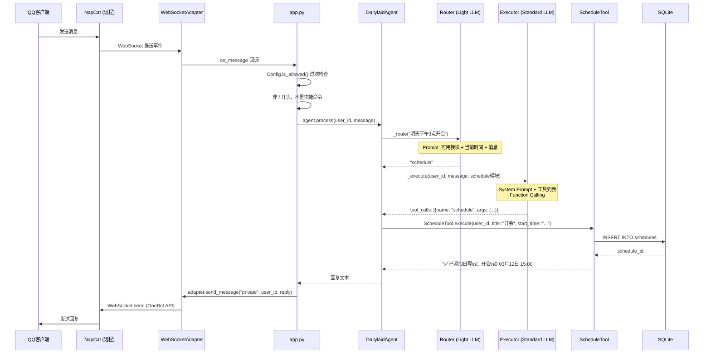
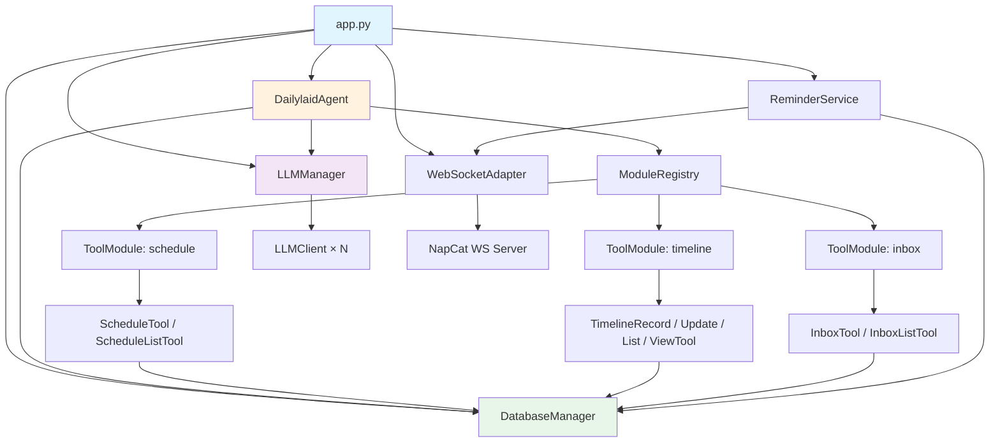

# 系统架构总览

本文档提供 Dailylaid 系统的全景视图，是理解项目的最佳入口。

---

## 📌 系统定位

Dailylaid 是一个 **QQ 机器人后端**，通过自然语言处理管理个人日常事务。它不是一个简单的指令式机器人，而是一个具备意图理解能力的 AI Agent。

**核心理念**：用户随意说一句话 → LLM 自动理解意图 → 调用对应工具执行 → 自然语言回复。

---

## 🏗️ 分层架构

```
┌───────────────────────────────────────────────────────────────────────┐
│                           Dailylaid Agent                            │
│                                                                       │
│  ┌─────────────┐                                                     │
│  │  NapCat QQ   │        ┌──────────────────────────────────────┐    │
│  │  (远程服务器)  │◄══WS═══│         网络适配器层                   │    │
│  └─────────────┘        │  BaseAdapter → WebSocketAdapter      │    │
│                          └──────────────┬───────────────────────┘    │
│                                         │                            │
│                          ┌──────────────▼───────────────────────┐    │
│                          │           入口层 (app.py)               │    │
│                          │  • 消息回调注册                         │    │
│                          │  • 快捷命令处理 (/help, /inbox, ...)   │    │
│                          │  • 提醒服务启动                         │    │
│                          └──────────────┬───────────────────────┘    │
│                                         │                            │
│                          ┌──────────────▼───────────────────────┐    │
│                          │        Agent 核心 (core/agent.py)      │    │
│                          │                                        │    │
│                          │  ┌── 第一层 Router ────────────────┐  │    │
│                          │  │  轻量 LLM 意图路由              │  │    │
│                          │  │  消息 → schedule/timeline/inbox │  │    │
│                          │  └────────────────────────────────┘  │    │
│                          │           ↓                            │    │
│                          │  ┌── 第二层 Executor ──────────────┐  │    │
│                          │  │  标准 LLM + Function Calling    │  │    │
│                          │  │  模块工具列表 → 工具调用         │  │    │
│                          │  └────────────────────────────────┘  │    │
│                          └──────────────┬───────────────────────┘    │
│                                         │                            │
│              ┌──────────────────────────┼──────────────────────┐     │
│              ▼                          ▼                      ▼     │
│  ┌───────────────────┐  ┌───────────────────┐  ┌──────────────────┐ │
│  │   schedule 模块    │  │   timeline 模块    │  │   inbox 模块     │ │
│  │  • ScheduleTool    │  │  • TimelineRecord  │  │  • InboxTool     │ │
│  │  • ScheduleListTool│  │  • TimelineUpdate  │  │  • InboxListTool │ │
│  │                    │  │  • TimelineList    │  │                  │ │
│  │                    │  │  • TimelineView    │  │                  │ │
│  └────────┬───────────┘  └────────┬───────────┘  └────────┬─────────┘ │
│           └──────────────────────┼──────────────────────┘          │
│                                  ▼                                  │
│                   ┌──────────────────────────────┐                  │
│                   │       数据层 (SQLite)          │                  │
│                   │   services/database.py        │                  │
│                   │   7 张表 · data/dailylaid.db  │                  │
│                   └──────────────────────────────┘                  │
│                                                                       │
│  ┌────────────────────┐  ┌────────────────────────┐                  │
│  │   提醒服务          │  │   MCP 工具服务器         │                  │
│  │   APScheduler      │  │   FastMCP               │                  │
│  │   每分钟检查日程     │  │   供外部 AI Agent 调用   │                  │
│  └────────────────────┘  └────────────────────────┘                  │
│                                                                       │
│  ┌────────────────────┐  ┌────────────────────────┐                  │
│  │   日志系统          │  │   配置系统               │                  │
│  │   utils/logger.py  │  │   config.py + .env      │                  │
│  │   控制台 + 文件双输出│  │   llm_config.yaml       │                  │
│  └────────────────────┘  └────────────────────────┘                  │
└───────────────────────────────────────────────────────────────────────┘
```

---

## 🔄 请求生命周期

以用户发送 **"明天下午3点开会"** 为例：



---

## 📦 组件清单

### 核心组件

| 组件 | 文件 | 职责 |
|------|------|------|
| **入口** | `app.py` | 异步主循环、组件初始化、消息分发 |
| **Agent** | `core/agent.py` | 两层架构核心、路由 + 执行协调 |
| **LLM 客户端** | `core/llm_client.py` | OpenAI-compatible API 调用封装 |
| **LLM 管理器** | `core/llm_manager.py` | 多模型管理、分级加载、故障切换 |
| **LLM 配置** | `core/llm_config.py` | 旧版配置管理（已部分被 LLMManager 替代） |
| **配置** | `config.py` | 环境变量加载、消息过滤 |

### 工具组件

| 组件 | 文件 | 职责 |
|------|------|------|
| **工具基类** | `tools/base_tool.py` | `BaseTool` 抽象类 + `ToolRegistry` |
| **模块系统** | `tools/modules.py` | `ToolModule` + `ModuleRegistry` |
| **日程工具** | `tools/schedule_tool.py` | 日程添加和查询 |
| **时间线工具** | `tools/timeline_tool.py` | 活动记录、更新、查看、可视化 |
| **收集箱工具** | `tools/inbox_tool.py` | 消息暂存与查看 |

### 服务组件

| 组件 | 文件 | 职责 |
|------|------|------|
| **数据库** | `services/database.py` | SQLite 管理器，7 张表 CRUD |
| **提醒服务** | `services/reminder_service.py` | APScheduler 定时提醒 |
| **适配器基类** | `services/adapters/base_adapter.py` | 网络适配器抽象接口 |
| **WS 适配器** | `services/adapters/ws_adapter.py` | 正向 WebSocket 客户端 |

### 辅助组件

| 组件 | 文件 | 职责 |
|------|------|------|
| **日志** | `utils/logger.py` | 集中式日志管理 |
| **MCP 服务器** | `mcp_server/server.py` | 外部 AI Agent 工具暴露 |
| **MCP 日程工具** | `mcp_server/tools/schedule_tool.py` | MCP 版日程 CRUD（含重复日程） |

---

## 🧩 组件依赖关系



---

## 📋 当前功能与路线图

### 已实现 ✅

- 两层 LLM Router + Executor 架构
- 正向 WebSocket 连接 NapCat（自动重连）
- 日程管理（添加 + 查询 + 定时提醒）
- 时间线活动记录（记录 + 更新 + 列表查看）
- 收集箱兜底机制
- 多模型分级配置 + 故障自动切换
- 快捷命令系统 (`/help`, `/inbox`, `/today`, `/week`)
- MCP 工具服务器（日程 CRUD + 重复日程）
- 消息过滤（白名单用户/群）

### 待实现 ⏳

| 功能 | 数据库表 | 优先级 | 说明 |
|------|----------|--------|------|
| 人情追踪 | `favors` ✅ | 中 | 表已建，需实现 Tool + Module |
| 待办管理 | `todos` ✅ | 中 | 表已建，需实现 Tool + Module |
| 兴趣收集 | `interests` ✅ | 低 | 表已建，需实现 Tool + Module |
| 时间线可视化 | - | 低 | SVG→PNG 渲染，`TimelineViewTool` 中标注 TODO |
| 收集箱归档 | - | 低 | `InboxTool.archive_item` 标注 TODO |
| HTTP 适配器 | - | 低 | `base_adapter.py` 接口已定义 |
| 反向 WS 适配器 | - | 低 | `base_adapter.py` 接口已定义 |

---

*最后更新: 2026-03-11*
